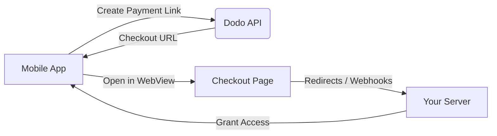

## Introduction

Dodo Payments empowers developers to sell digital goods and services in iOS apps, handling complex aspects like tax compliance, currency conversion, and payouts. This comprehensive guide details how to integrate Dodo Payments into your iOS app, specifically for SaaS tools, content subscriptions, and digital utilities.

## Overview
Dodo Payments serves as your **Merchant of Record (MoR)**, managing critical aspects of your digital business:

### What We Handle
- ✅ Tax collection and remittance (VAT, GST, and other regional taxes)
- ✅ Global payments as per policies and local payment methods
- ✅ Currency conversion and foreign exchange
- ✅ Chargebacks and fraud prevention
- ✅ End-customer invoicing and receipts
- ✅ Compliance with regional regulations

### What You Get
- 🚀 A unified API for web and mobile platforms
- 💳 Support for in-app checkouts (UPI, cards, wallets, BNPL)
- 🌍 Global payout support (Payoneer, Wise, local bank transfers)
- 📊 Analytics and reporting dashboard
- 🔒 Secure payment processing

---

## Use Cases

### 📱 Subscriptions
- Premium content or feature access
- Recurring billing with flexible options:
  - Free trials
  - Proration
  - Upgrades and downgrades

### 📚 Courses and Learning
- Pay-per-course access
- Bundled content packages
- Lifetime or renewable licenses
- Progress tracking integration

### 🎵 Digital Downloads
- One-time purchases (PDFs, music, tools)
- Digital asset delivery
- License key management

### 🛠️ SaaS Tools
- Software-as-a-Service subscriptions
- Usage-based billing
- Team and enterprise plans

---

## Integration Flow

You can integrate Dodo Payments into your app using our hosted checkout or in-app browser solution.

1. **Mobile App to Dodo API**: The process begins with the mobile app creating a payment link by interacting with the Dodo API.
2. **Dodo API to Mobile App**: The Dodo API responds by providing a checkout URL back to the mobile app.
3. **Mobile App to Checkout Page**: The mobile app then opens this checkout URL within a WebView, leading the user to the checkout page.
4. **Checkout Page to Your Server**: Upon completion of the checkout process, the checkout page communicates with your server through redirects or webhooks.
5. **Your Server to Mobile App**: Finally, your server grants access to the purchased content or service, completing the transaction cycle back in the mobile app.

<Card title="Mobile Integration Guide" icon="mobile" href="/developer-resources/mobile-integration">
    For a complete developer walkthrough, explore our Mobile Integration Guide.
</Card>

## Regional Availability

Dodo Payments enables alternative in-app purchase flows only in App Store regions where Apple explicitly allows external payments, or where a regulator or court order mandates it. As of now, these regions include:

- **United States**: Supported to the extent permitted by current court orders and Apple’s updated guidelines.
- **European Union (EU) App Store**: Supported via Apple’s EU Alternative Terms and External Purchase Entitlement.
- **South Korea**: Supported through the StoreKit External Purchase Entitlement for Korea-only binaries.

<Warning>
Always review and comply with Apple’s region-specific entitlements and App Store Connect requirements before enabling Dodo Payments for any storefront. Using alternative payment flows in unsupported regions may result in app rejection or removal.
</Warning>

<Note>
For some business models - such as services or certain categories of content - Apple may not require the use of in-app purchase (IAP) at all. Dodo Payments supports these models as well. Always verify your app’s classification and Apple’s latest guidelines to determine if IAP is mandatory for your use case.
</Note>

For a detailed breakdown of global policies, legal precedents, and strategic approaches to bypassing App Store fees, see our comprehensive guide:

<Card
  title="Bypassing App Store & Play Store Fees: A Strategic and Legal Playbook"
  icon="shield-check"
  href="/features/bypassing-app-store-fees"
>
  Learn where and how you can legally implement alternative payment flows, with up-to-date regional guidance and compliance tips.
</Card>